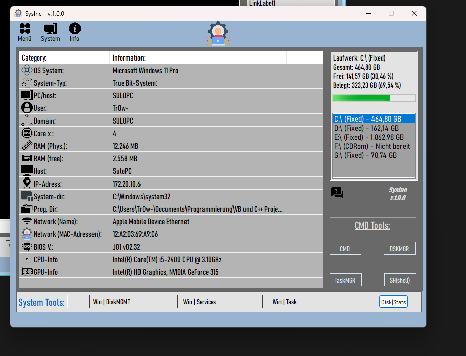

# SystemINC - Ihr System-Informations-Tool

 SystemINC ist eine schlanke und intuitive Desktop-Anwendung, die entwickelt wurde, um Benutzern einen schnellen Überblick über wichtige Systeminformationen ihres Computers zu verschaffen. Von grundlegenden Betriebssystemdetails über detaillierte Festplatteninformationen bis hin zu einer integrierten Shell-Konsole bietet SystemINC die notwendigen Tools für einen schnellen Systemcheck.

## Inhaltsverzeichnis

* [Über SystemINC](#über-systeminc)
* [Funktionen](#funktionen)
* [Technologien](#technologien)
* [Installation und Ausführung](#installation-und-ausführung)
* [Verwendung](#verwendung)
    * [Systemübersicht](#systemübersicht)
    * [Festplatteninformationen](#festplatteninformationen)
    * [Shell-Konsole](#shell-konsole)
    * [FAQ](#faq)
    * [Datenexport](#datenexport)
* [Datenbank und Persistenz](#datenbank-und-persistenz)
* [Exportierte XML-Dateien stylen](#exportierte-xml-dateien-stylen)
* [Beiträge](#beiträge)
* [Lizenz](#lizenz)

## Über SystemINC

SystemINC entstand aus dem Bedürfnis heraus, zentrale Systeminformationen an einem Ort zu bündeln und zugänglich zu machen. Es richtet sich an Benutzer, die schnell und unkompliziert tiefergehende Einblicke in ihre Hardware- und Softwareumgebung erhalten möchten, ohne komplexe Systemtools navigieren zu müssen.

## Funktionen

* **Systemübersicht**: Zeigt Kerninformationen über Ihr Betriebssystem, Prozessor, Arbeitsspeicher, Benutzer, Netzwerk und BIOS.
* **Festplatteninformationen**: Detaillierte Ansicht aller erkannten Speicherlaufwerke mit Informationen zu Größe, belegtem und freiem Speicherplatz, visualisiert durch Fortschrittsbalken.
* **Integrierte Shell-Konsole**: Führen Sie Kommandozeilenbefehle direkt in der Anwendung aus und sehen Sie die Ausgabe in Echtzeit.
* **FAQ-Bereich**: Ein integriertes Hilfesystem mit häufig gestellten Fragen, die dynamisch aus einer XML-Datei geladen werden und eine übersichtliche Navigation per TreeView und ListBox bieten.
* **Systeminformationen-Historie**: Speichert automatisch gesammelte Systeminformationen in einer lokalen SQLite-Datenbank.
* **XML-Export**: Exportieren Sie aktuelle Systeminformationen in eine strukturierte XML-Datei, die für externe Analysen oder zur Dokumentation verwendet werden kann.
* **Visueller XML-Export**: Die exportierten XML-Dateien sind mit einem XSLT-Stylesheet verknüpft, das eine grafisch ansprechende Anzeige im Webbrowser ermöglicht.

## Technologien

* **Visual Basic .NET (VB.NET)**: Die Hauptentwicklungssprache für die Desktop-Anwendung.
* **.NET Framework**: Basis-Framework für die Anwendung.
* **Windows Management Instrumentation (WMI)**: Wird intensiv genutzt, um detaillierte Systeminformationen abzurufen.
* **SQLite**: Eine leichte, dateibasierte Datenbank für die lokale Speicherung von Systeminformationen-Historien.
* **LINQ to XML**: Für das einfache Erstellen und Bearbeiten von XML-Dokumenten.
* **XSLT**: Für die Transformation der exportierten XML-Daten in ansprechendes HTML für die Browseranzeige.
* **CSS**: Für das Styling der HTML-Ausgabe des XSLT.

## Installation und Ausführung

1.  **Repository klonen**:
    ```bash
    git clone [https://github.com/IhrBenutzername/SystemINC.git](https://github.com/IhrBenutzername/SystemINC.git)
    cd SystemINC
    ```
2.  **Visual Studio öffnen**: Öffnen Sie die `.sln`-Datei in Visual Studio (empfohlen: Visual Studio 2019 oder neuer).
3.  **NuGet-Pakete wiederherstellen**: Stellen Sie sicher, dass alle NuGet-Pakete (insbesondere `System.Data.SQLite`) wiederhergestellt werden. Visual Studio sollte dies automatisch tun, oder Sie können es manuell über `Projekt` > `NuGet-Pakete verwalten...` > `Wiederherstellen` tun.
4.  **Kompilieren und Ausführen**: Kompilieren Sie das Projekt und führen Sie die Anwendung aus.

## Verwendung

### Systemübersicht

Nach dem Start zeigt SystemINC eine Übersicht über Ihr Betriebssystem, CPU, RAM, Netzwerk und andere allgemeine Systemdetails.

### Festplatteninformationen

Wählen Sie ein Laufwerk aus der Liste (z.B. "C:", "D:"), um detaillierte Informationen über dessen Größe, freien und belegten Speicherplatz anzuzeigen. Eine Fortschrittsleiste visualisiert die Auslastung.

### Shell-Konsole

Klicken Sie auf "Shell starten", um die integrierte Konsole zu aktivieren. Geben Sie Befehle in das Eingabefeld ein und drücken Sie Enter oder den "Senden"-Button. Die Ausgabe erscheint direkt in der Konsole. Fehler werden rot, Eingaben grün angezeigt.

### FAQ

Rufen Sie den FAQ-Bereich auf, um Antworten auf häufig gestellte Fragen zur Nutzung von SystemINC zu finden. Die Fragen sind hierarchisch organisiert und bieten eine schnelle Navigation.

### Datenexport

Sie können die aktuellen Systeminformationen in eine XML-Datei exportieren. Klicken Sie auf den entsprechenden Export-Button und wählen Sie einen Speicherort.

### Datenbank und Persistenz

SystemINC speichert die gesammelten Systeminformationen automatisch beim Start in einer lokalen `SystemInfo.db` (SQLite) Datenbank. Diese Datenbank wird im Anwendungsverzeichnis erstellt und verwaltet.

### Exportierte XML-Dateien stylen

Die von SystemINC exportierten XML-Dateien (`SystemInfoExport_*.xml`) enthalten einen Verweis auf das `SystemInfoExport.xsl`-Stylesheet. Wenn Sie die XML-Datei in einem Webbrowser (z.B. Chrome, Firefox, Edge) öffnen, wird das Stylesheet angewendet, um die Systeminformationen in einem modernen und übersichtlichen HTML-Format darzustellen. Stellen Sie sicher, dass die `SystemInfoExport.xsl`-Datei sich im selben Verzeichnis wie die exportierte XML-Datei befindet.

## Beiträge

Wir freuen uns über Beiträge! Wenn Sie Fehler finden, Verbesserungen vorschlagen oder neue Funktionen hinzufügen möchten, eröffnen Sie bitte ein Issue oder reichen Sie einen Pull Request ein.

## Lizenz

Dieses Projekt steht unter der [MIT-Lizenz](LICENSE).

---

**Daniel Trojan**
